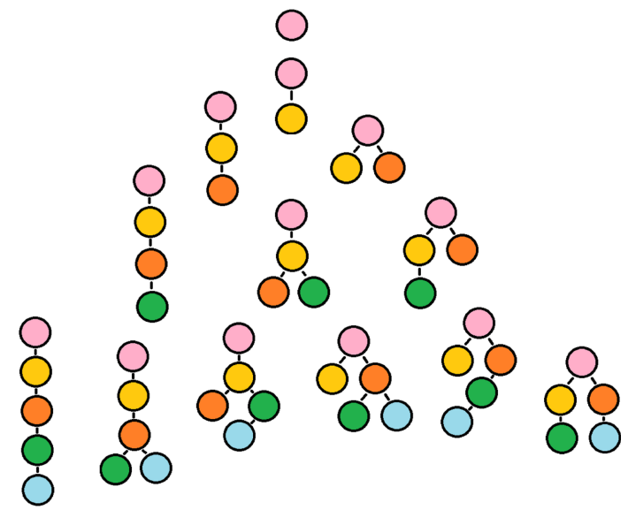

# SMASH - Subclone Multiplicity Allocation and Somatic Heterogeneity

<!-- badges: start -->


<!-- badges: end -->

This package is designed to cluster somatic mutations called from a tumor sample with a matched normal sample. Each mutation is assumed to lie in a genomic segment of clonal copy number. Each mutation's inferred clonal copy number and the tumor purity estimate is required as input to successfully run the program. This information can be obtained by running algorithms such as ABSOLUTE or ASCAT that derive tumor purity and clonal copy number estimates from SNP Array intensities.

<p align="center">

</p>

## Installation

```R
# Dependencies
req_packs = c("Rcpp","RcppArmadillo","devtools",
	"smarter","SMASH")
all_packs = as.character(installed.packages()[,1])
rerun = 0
build_vign = ifelse(Sys.getenv("RSTUDIO_PANDOC") == "",FALSE,TRUE)

for(pack in req_packs){
	if( pack %in% all_packs ){
		library(package = pack,character.only = TRUE)
		next
	}
	
	bb = NULL
	
	if( pack %in% "smarter" ){
		bb = tryCatch(devtools::install_github("pllittle/smarter",
			dependencies = TRUE),
			error = function(ee){"error"})
	} else if( pack %in% "SMASH" ){
		bb = tryCatch(devtools::install_github("Sun-lab/SMASH",
			build_vignettes = build_vign,
			dependencies = TRUE),
			error = function(ee){"error"})
	} else {
		bb = tryCatch(devtools::install.packages(pkgs = pack,
			dependencies = TRUE),
			error = function(ee){"error"})
	}
	
	if( !is.null(bb) && bb == "error" )
		stop(sprintf("Error for package = %s",pack))
	rerun = 1

}

if( rerun == 1 ) stop("Re-run above code")

```

## Vignette

To see the vignette, follow the code below. The vignette contains background knowledge and code to perform simulation, optimization, interpretation, and visualization.

```R
library(SMASH)
vignette(package = "SMASH",topic = "intro")
```

## Citation

Little, P., Lin, D.Y., [Sun, W.](https://github.com/sunway1999) (2019). Associating somatic mutations to clinical outcomes: a pan-cancer study of survival time. *Genome medicine,* 11(1), 1-15. [[HTML](https://genomemedicine.biomedcentral.com/articles/10.1186/s13073-019-0643-9), [PDF](https://genomemedicine.biomedcentral.com/track/pdf/10.1186/s13073-019-0643-9.pdf), [Supplement](https://static-content.springer.com/esm/art%3A10.1186%2Fs13073-019-0643-9/MediaObjects/13073_2019_643_MOESM1_ESM.pdf)]

