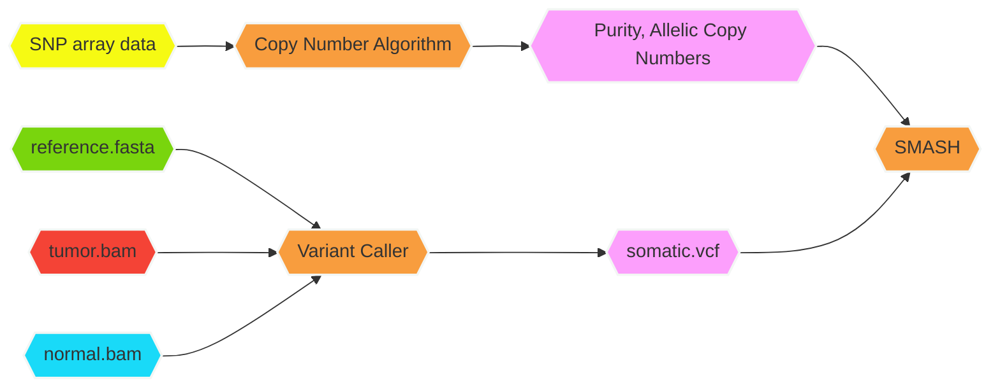

<div align="left">
<a href=""></a>
</div>

<!-- badges: start -->


[](https://doi.org/10.1186/s13073-019-0643-9)
[](https://www.repostatus.org/#active)
[](https://github.com/Sun-lab/SMASH)
[](https://github.com/Sun-lab/SMASH/commits/master)
<!-- badges: end -->

## Table of Contents

* [What is this for?](#what-is-this-for)
* [Installation](#installation)
* [Vignette](#vignette)
* [Workflow](#workflow)
* [Citation](#citation)
* [Contact](#contact)
* [FAQs](#faqs)

## What is this for?

This package is designed to cluster somatic mutations called from a 
tumor sample with a matched normal sample. Each mutation is assumed 
to lie in a genomic segment of clonal copy number. Each mutation's 
inferred clonal copy number and the tumor purity estimate is required 
as input to successfully run the program. This information can be 
obtained by running algorithms such as ABSOLUTE or ASCAT that derive 
tumor purity and clonal copy number estimates from SNP Array intensities.

<p align="center">

<p align="center"><em>Visualizing subclone configurations.</em></p>
</p>

## Installation

<details>

<summary>Click to expand!</summary>

Copy/paste the following code into R/RStudio for **SMASH** installation.

```R
pandoc = Sys.getenv("RSTUDIO_PANDOC")

cran_packs = c("Rcpp","RcppArmadillo","devtools","smarter","SMASH")
req_packs = c(cran_packs)

for(pack in req_packs){
	
	chk_pack = tryCatch(find.package(pack),
		error = function(ee){NULL})
	
	if( !is.null(chk_pack) ){
		library(pack,character.only = TRUE)
		next
	}
	
	if( pack %in% cran_packs ){
		install.packages(pack,dependencies = TRUE)
	}
	
}

```

</details>

## Vignette

To see the vignette, follow the code below. The vignette contains background 
knowledge and code to perform simulation, optimization, interpretation, 
and visualization.

```R
library(SMASH)
vignette(package = "SMASH",topic = "intro")
```

## Workflow



## Citation

Little, P., [Lin, D.Y.](https://sph.unc.edu/adv_profile/danyu-lin-phd/), 
[Sun, W.](https://github.com/sunway1999) (2019). 
Associating somatic mutations to clinical outcomes: a pan-cancer 
study of survival time. *Genome medicine,* 11(1), 1-15. 
[[HTML](https://genomemedicine.biomedcentral.com/articles/10.1186/s13073-019-0643-9), 
[PDF](https://genomemedicine.biomedcentral.com/track/pdf/10.1186/s13073-019-0643-9.pdf), 
[Supplement](https://static-content.springer.com/esm/art%3A10.1186%2Fs13073-019-0643-9/MediaObjects/13073_2019_643_MOESM1_ESM.pdf)]

## Contact

* [Feel free to reach out](mailto:pllittle321@gmail.com?subject=SMASH:%20Q%26A&body=Dear%20Dr.%20Little,%0A%0A%0A)

## FAQs
